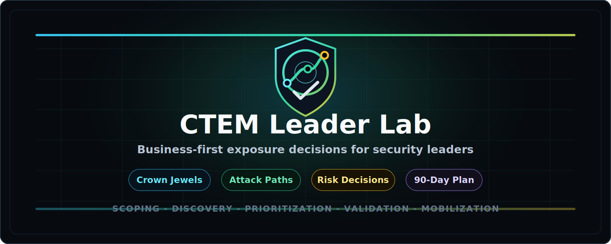
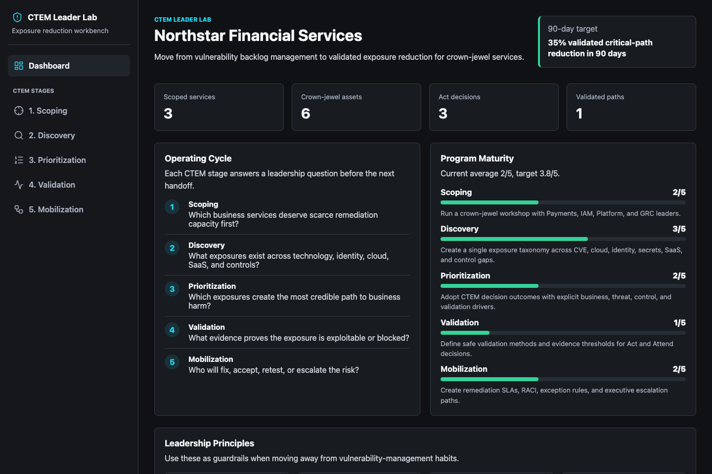
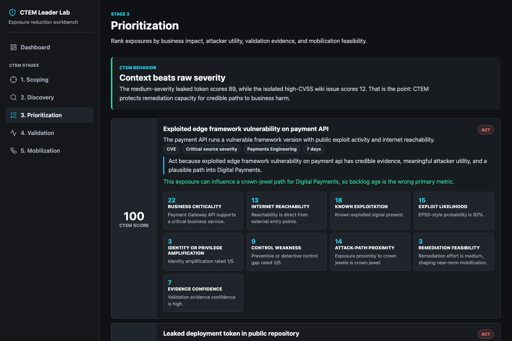
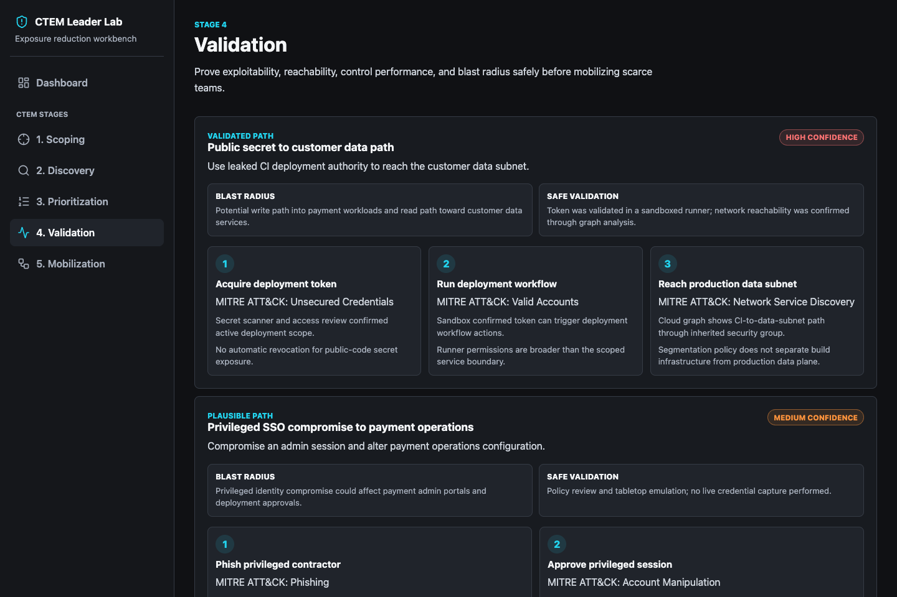
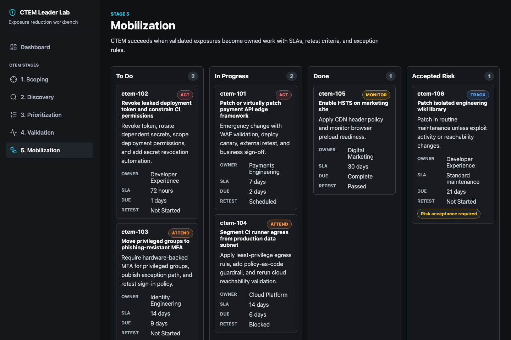

<p align="center">
  
</p>

<h1 align="center">CTEM Leader Lab</h1>

<p align="center">
  An interactive implementation workbench for security leaders moving from vulnerability management to Continuous Threat Exposure Management.
</p>

<p align="center">
  <a href="#quick-start">Quick Start</a> ·
  <a href="#why-ctem">Why CTEM</a> ·
  <a href="#leader-workflows">Leader Workflows</a> ·
  <a href="#scoring-model">Scoring Model</a> ·
  <a href="#roadmap">Roadmap</a> ·
  <a href="./docs/workshop-guide.md">Workshop Guide</a>
</p>

<p align="center">
  
  <a href="https://github.com/themayursinha/ctem-leader-lab/actions/workflows/ci.yml">
    
  </a>
  
  
  
  
</p>

<p align="center">
  <a href="https://themayursinha.github.io/ctem-leader-lab/">Live Demo</a> ·
  <a href="./docs/quick-start.md">Local Setup</a> ·
  <a href="./CHANGELOG.md">Release Notes</a>
</p>

---

## Why CTEM

Traditional vulnerability management often asks: **Which CVEs are severe enough to patch first?**

Continuous Threat Exposure Management asks: **Which validated exposure paths create the most credible business risk, and who will reduce them?**

CTEM Leader Lab is a fictional, scenario-driven product for CISOs, security directors, and security program owners. It teaches how to scope crown-jewel services, discover exposures across domains, prioritize by business and threat context, validate attack paths safely, and mobilize remediation with accountable owners.

This is not a scanner. It is a leadership workbench for learning the CTEM operating model.

## Quick Start

Backend:

```bash
cd backend
python -m venv .venv
source .venv/bin/activate
pip install -r requirements.txt
uvicorn main:app --reload
```

Frontend:

```bash
cd frontend
npm install
npm run dev
```

Open `http://localhost:5173`.

The frontend also includes static demo data under `frontend/public/api`, so the GitHub Pages build works without a running backend.

## Screenshots

### Executive Dashboard



### Prioritization



### Validation



### Mobilization



## What Makes It Different

- **Business-first scoping:** Starts with critical services, crown-jewel assets, owners, and risk appetite.
- **Exposure, not vulnerability, inventory:** Models CVEs, cloud misconfigurations, identity weaknesses, leaked secrets, SaaS posture, and control gaps.
- **Transparent CTEM scoring:** Combines business criticality, reachability, known exploitation, EPSS-style likelihood, identity/control weakness, attack-path proximity, remediation feasibility, and evidence confidence.
- **Validation evidence:** Connects prioritization to safe attack-path evidence, blast radius, and control-performance checks.
- **Mobilization:** Turns validated exposure into owner, SLA, RACI, retest, exception, and executive escalation workflows.

## Leader Workflows

| Stage | Leader question | Output |
| --- | --- | --- |
| Scoping | Which business services deserve scarce remediation capacity first? | Crown-jewel worksheet and scoped asset map |
| Discovery | What exposures exist across technology, identity, cloud, SaaS, and controls? | Normalized exposure inventory |
| Prioritization | Which exposures create the most credible path to business harm? | Act, Attend, Monitor, or Track decisions |
| Validation | What evidence proves exploitability, reachability, or control failure? | Attack-path evidence pack |
| Mobilization | Who will fix, accept, retest, or escalate the risk? | Remediation board, RACI, and 30/60/90 plan |

## Scoring Model

The MVP uses realistic seeded data and a transparent decision engine. It intentionally lets a medium-severity identity or secret exposure outrank an isolated high-CVSS issue when validation shows a stronger path to a crown-jewel business service.

Decision outcomes:

- **Act:** Validated or high-confidence path to business harm. Mobilize immediately.
- **Attend:** Important scoped exposure that needs leadership-backed coordination.
- **Monitor:** Real issue, but current evidence does not justify urgent mobilization.
- **Track:** Handle through normal hygiene unless threat or reachability changes.

Read more in [docs/scoring-model.md](./docs/scoring-model.md).

## Project Structure

```text
backend/    FastAPI API, seeded CTEM scenario data, scoring engine, tests
frontend/   React/Vite leader workbench UI
docs/       Operating model, quick start, scoring model, workshop guide
assets/     README and project visuals
.github/    CI workflow and contribution templates
```

## Verification

Backend:

```bash
cd backend
pytest
```

Frontend:

```bash
cd frontend
npm run lint
npm run build
```

## Roadmap

- `v0.1.0`: Scenario-driven CTEM Leader Lab MVP.
- `v0.2.0`: CSV import/export for assets, exposures, and remediation actions.
- `v0.3.0`: Saved workshop sessions and exportable executive summary.
- `v0.4.0`: Optional integrations for scanner, cloud, identity, and ticketing data.

## Contributing

Contributions are welcome when they improve the leader learning experience, CTEM operating model, data realism, scoring transparency, documentation, or test coverage. See [CONTRIBUTING.md](./CONTRIBUTING.md).

## Security

This project contains fictional seed data and is not an offensive testing tool. Do not use it to test systems you do not own or have permission to assess. See [SECURITY.md](./SECURITY.md).

## License

MIT. See [LICENSE](./LICENSE).
